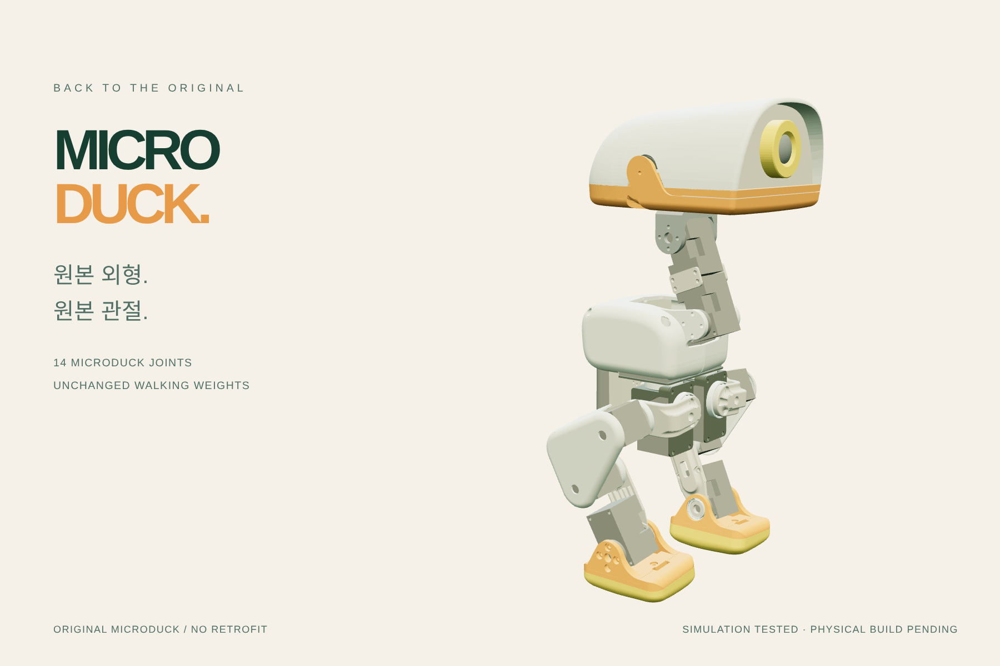
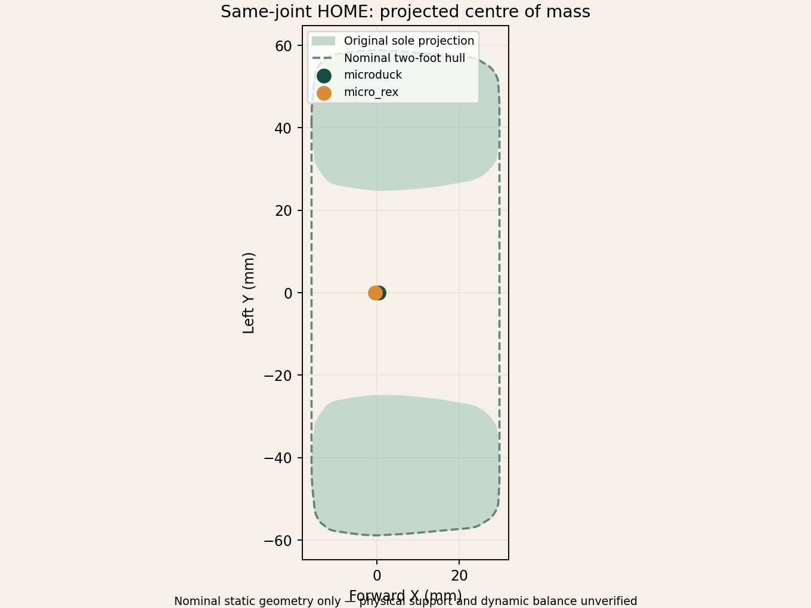

# MICRODUCK 원본으로 복귀

[](https://hwkim3330.github.io/micro-rex/web/)

현재 기본 화면은 **공룡 외장을 제거한 Microduck 원본**입니다. 원본 14개 관절과 공식 가중치의 계산 기록을 유지합니다. 이전 Micro Rex 외장은 비교 메뉴와 설계 기록으로 보존합니다.

원본 하드웨어의 비상업 조건은 그대로이며, 별도 상업용 독자 설계 [Micro X](https://github.com/hwkim3330/micro-x)의 권리 범위와 혼동하지 않습니다.

[원본 3D 보기](https://hwkim3330.github.io/micro-rex/web/) · [원본 외형 GLB](models/microduck_original.glb) · [원본 모델·자산](vendor/microduck/)

## 이전 Micro Rex 외장 기록


큰 눈, 작은 앞발, 긴 꼬리. **Microduck의 14개 관절과 공식 보행 가중치를 유지하는 작은 티렉스**를 만듭니다. 이 절은 이전 외장 설계 기록입니다.

[3D 모델 돌려보기](https://hwkim3330.github.io/micro-rex/) · [도면 PDF](drawings/Micro_Rex_Drawings.pdf) · [STEP 조립 파일](models/micro_rex_retrofit.step) · [GLB 전체 모델](models/micro_rex.glb) · [출력 STL](models/print/) · [검증 보고서](artifacts/validation.json)

현재 모델은 **Rev C 호환 외장 프로토타입**입니다. 눈의 뒤쪽 나사 고정, 머리 스트랩 슬롯, 안쪽 경량 포켓과 가장자리 보강부를 추가했습니다. 공식 가중치의 시뮬레이션, 무게중심 및 눈 고정부의 디지털 검사를 제공합니다. 실물 강도와 보행 시험은 아직 남아 있습니다.

먼저 **같은 관절의 Micro Rex**를 검증하고, 그다음 **저가형 Nano Rex**를 개발합니다. 네발형은 공개 모델에서 내렸습니다. [제품 순서와 완료 기준](docs/PRODUCT_SEQUENCE.md)

[가중치 시험](docs/POLICY_COMPATIBILITY.md) · [무게중심](artifacts/balance_study.json) · [눈 고정부](artifacts/retention_check.json)

## 무엇을 만들었나

- 카메라 앞을 개방한 둥근 볼판, 뒤쪽에서 나사로 고정하는 큰 눈, 위쪽 스트랩 브리지.
- 작은 앞발과 장착 브래킷, 속이 빈 분할 꼬리와 스트랩 장착판.
- 수정 가능한 CadQuery 원본, 개별 STEP/STL, 16개 부품의 출력 방향 정리본.
- 전체 로봇 GLB, 외장 STEP 조립 파일, MuJoCo 모델 및 지면이 포함된 장면.
- 실제 형상에서 생성한 17쪽 치수 참고 도면과 부품 목록.
- PC·모바일 브라우저에서 회전·확대·분해 보기 및 원본 부품 표시 전환.

기존 Microduck보다 개선하려는 항목은 외장 수정/교체의 용이성, 출력 파일·도면 제공, 추적 가능한 호환성 검사입니다. 속도·안정성·배터리 수명 향상은 아직 입증하지 않았습니다.

## 호환성 확인 범위

| 항목 | 결과 |
|---|---|
| 원본 정책 제어 관절 | **14개**, 이름·순서 유지 |
| 관절 축·위치·가동 범위 | 원본과 배열 비교 통과 |
| 액추에이터 연결·제어 범위·힘 제한 | 원본과 배열 비교 통과 |
| 센서 종류·차원·연결 ID | 원본과 배열 비교 통과 |
| 원본 모델 질량 | 737.24 g |
| Micro Rex 모델 질량 | 783.77 g, 추가 체결구 실측 전 |
| 예상 외장 추가 질량 | 46.53 g, PLA 실체적 환산 |
| 새 출력 STL | 16개, 폐곡면 및 양의 체적 검사 통과 |
| 단순 PD 자세 유지 | **원본과 Micro Rex 모두 3초 직립 실패**; 정책 평가가 아님 |
| 공식 ONNX + BAM 평지 시험 | 원본 12회 + 외장 12회, 각 10초 넘어짐 기준 미도달; 속도·방향 추종 부족 |
| 공식 서기 가중치 + 머리 명령 | 원본 3회 + 외장 3회, 각 10초 넘어짐 기준 미도달 |
| 같은 HOME 자세의 무게중심 변화 | 뒤로 0.96 mm / 위로 4.58 mm; 두 발 접지 가정의 정적 계산 |
| 눈·와셔 체결 공간 | 6개 STEP 조합 겹침 없음; 인발·토크 실물 시험 전 |
| 실물 조립 / sim-to-real | **미검증** |

원본 로봇의 입 모터는 14차원 보행 정책과 별도입니다. 이 패키지는 입 모터 제어를 추가하거나 15차원 정책으로 바꾸지 않습니다. 꼬리·앞발은 정적 외장입니다. 추가 질량과 관성은 모델에 반영했으며, 기존 보행 정책을 그대로 쓰면 동일 성능이 나온다고 보장하지 않습니다.



목·머리 각도를 바꾼 일곱 자세에서 가정한 두 발 지지영역까지 최소 여유는 7.46 mm입니다. 실제 접촉력이나 보행 중 안정성을 증명하는 값은 아닙니다. 머리 5g·몸통 5g의 미실측 체결구 예산도 별도 민감도 계산에 기록했습니다.

## 원본 자료도 함께 받기

공식 제어 소프트웨어, 공식 RL/메시, 공식 Robot HAT 회로도, 커뮤니티 역설계 도면을 서로 구분해 고정 커밋으로 연결합니다.

```bash
git clone --recurse-submodules https://github.com/hwkim3330/micro-rex.git
cd micro-rex
```

이미 클론했다면 `git submodule update --init --recursive`를 실행합니다. 모든 출처와 커밋은 [upstream.lock.json](upstream.lock.json), 자료별 상태는 [출처 기록](docs/SOURCES.md)에 있습니다. 커뮤니티 역설계 자료는 공식 공장 도면으로 취급하지 않습니다.

## 모델 재생성

Python 3.11 이상, Linux 기준입니다.

```bash
python -m venv .venv
source .venv/bin/activate
pip install -r requirements.txt
python cad/build.py
python tools/print_parts.py
python tools/tail_continuous.py
python tools/retention_check.py
python tools/balance_study.py
python tools/validate.py
MUJOCO_GL=egl python tools/render.py  # EGL 환경 필요; 정적 렌더는 이미 포함
python tools/drawings.py
```

기구를 변경한 뒤에는 [정책 평가](docs/POLICY_COMPATIBILITY.md)를 다시 실행해야 기존 평가 기록의 모델 SHA가 맞습니다. README 대표 이미지는 `node tools/readme-portrait.mjs`로 현재 GLB와 기록 자세에서 다시 생성합니다.

`models/parts/`는 조립 기준 좌표, `models/print/`는 중심 정렬 및 출력면을 맞춘 파일입니다. 원본 로봇의 STL은 `vendor/microduck/assets/`에 있습니다. 전체 조립 STEP은 **새 외장**만 정확한 CAD 솔리드로 담고, 원본 전체 로봇 형상은 GLB와 upstream STL/MJCF로 제공합니다.

```bash
python -m http.server 5190
# http://127.0.0.1:5190/web/
```

뷰어 라이브러리도 저장소 안에 있으므로 외부 CDN이 필요 없습니다. 모델을 MuJoCo에서 열려면 `models/scene.xml`을 사용합니다.

개발자 브라우저 검사: `npm ci --ignore-scripts && npm run test:viewer`. 설치된 Chrome 경로는 `CHROME_PATH`로 지정할 수 있습니다.

## 제작 전 확인

[조립 및 검증 항목](docs/ASSEMBLY.md)을 먼저 확인하세요. 현재 꼬리 조인트, 스트랩 고정, 나사 체결 길이와 가동 중 간섭은 실물 확인 대상입니다. 도면은 프로토타입 치수 참고용이며 공장 제작 승인도면이 아닙니다.

## 라이선스

독립 프로젝트이며 Pollen Robotics 또는 Hugging Face의 공식 제품이 아닙니다.

- 새 코드: Apache-2.0.
- 원본 하드웨어 모델: upstream의 **CC BY-SA-NC** 표기 유지.
- 새 외장 및 파생 모델·도면: **CC BY-NC-SA 4.0**, 원본 하드웨어 조건도 적용.
- Three.js: MIT.

[자세한 출처·라이선스](licenses/HARDWARE.md). 상업 사용을 허용하는 하드웨어 패키지가 아닙니다.

### 공개 웹 제작실

[GitHub Pages](https://hwkim3330.github.io/micro-rex/)에서 14개 관절 자세 조절, 부품 선택 및 치수 확인, 조립·분해 보기, 원본 부품 표시 전환, 카메라 방향 선택과 PNG 저장을 제공합니다. 부품 표에서 출력용 mm STL과 STEP을 내려받을 수 있습니다. PC와 모바일 레이아웃을 제공합니다.

브라우저 수동 관절 조절은 원본 MJCF에서 생성한 **기구학 시연**입니다. 새로 추가한 **시뮬레이션 기록 재생**은 공식 ONNX 가중치로 계산한 원본·외장 모델의 몸체와 관절 좌표를 재생합니다. 실물 제작과 보행 검증 완료를 의미하지 않습니다.
